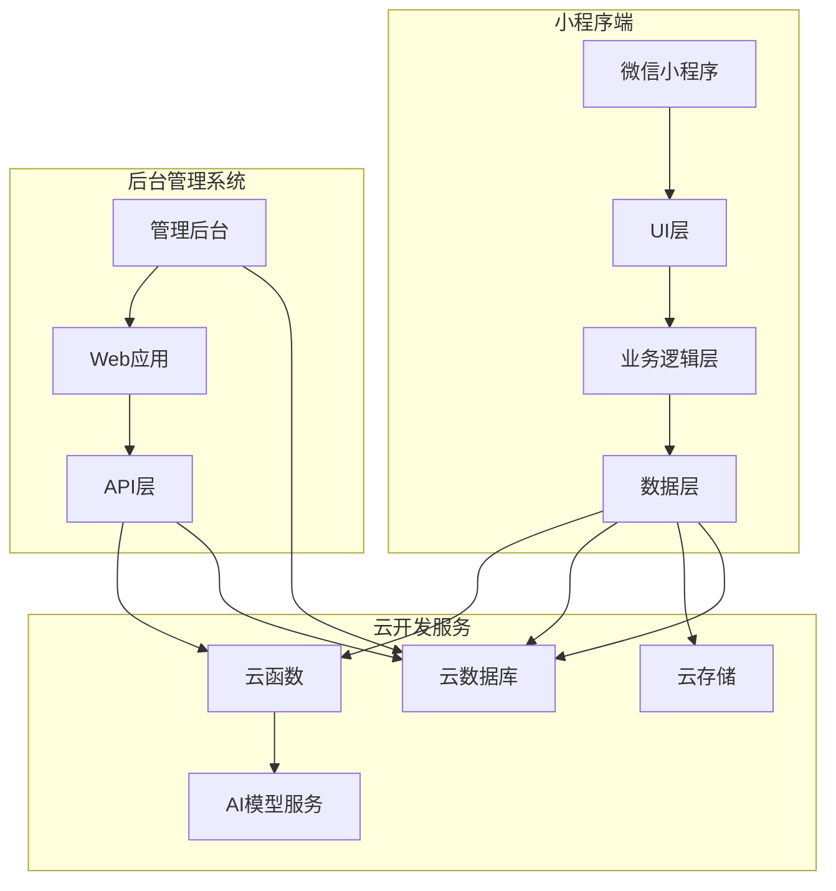

# 技术方案设计文档 - 老人健康记录小程序

## 文档信息
- **项目名称**: 老人健康记录小程序
- **文档版本**: v1.0
- **创建日期**: 2026-01-31
- **文档类型**: 技术设计文档

## 1. 系统架构

### 1.1 整体架构



### 1.2 技术栈选择

| 层次 | 小程序端 | 后台管理系统 |
|------|----------|--------------|
| 前端框架 | 微信小程序原生 | Vue 3 + Element Plus |
| 语言 | JavaScript | TypeScript |
| UI框架 | 微信原生组件 | Element Plus |
| 状态管理 | - | Pinia |
| 后端服务 | 腾讯云开发(CloudBase) | 腾讯云开发(CloudBase) |
| 数据库 | 云数据库 | 云数据库 |
| 存储 | 云存储 | - |
| AI能力 | 云开发AI服务 | 云开发AI服务 |

## 2. 数据库设计

### 2.1 数据库选择
使用腾讯云开发云数据库(NoSQL),支持实时同步和权限控制。

### 2.2 数据集合设计

#### 2.2.1 users(用户表)

```javascript
{
  "_id": "自动生成",
  "_openid": "用户微信openid",
  "nickname": "老人昵称",
  "avatar": "头像URL",
  "gender": "性别(0:未知 1:男 2:女)",
  "birthday": "出生日期",
  "hasDiabetes": "是否患有糖尿病",
  "hasHypertension": "是否患有高血压",
  "emergencyContact": "紧急联系人",
  "emergencyPhone": "紧急联系电话",
  "createTime": "创建时间",
  "updateTime": "更新时间"
}
```

#### 2.2.2 blood_glucose(血糖记录表)

```javascript
{
  "_id": "自动生成",
  "_openid": "用户openid",
  "measureTime": "测量时间戳",
  "measureType": "测量类型(1:空腹 2:早餐后 3:午餐后 4:晚餐后 5:睡前)",
  "value": "血糖值(mmol/L)",
  "isAbnormal": "是否异常",
  "abnormalType": "异常类型(0:正常 1:高血糖 2:低血糖)",
  "photoUrl": "照片URL(拍照记录时)",
  "createTime": "记录创建时间"
}
```

#### 2.2.3 blood_pressure(血压记录表)

```javascript
{
  "_id": "自动生成",
  "_openid": "用户openid",
  "measureTime": "测量时间戳",
  "systolic": "收缩压(mmHg)",
  "diastolic": "舒张压(mmHg)",
  "heartRate": "心率(次/分,可选)",
  "isAbnormal": "是否异常",
  "abnormalType": "异常类型(0:正常 1:高血压 2:低血压)",
  "photoUrl": "照片URL(拍照记录时)",
  "createTime": "记录创建时间"
}
```

#### 2.2.4 admins(管理员表)

```javascript
{
  "_id": "自动生成",
  "username": "管理员用户名",
  "password": "加密后的密码",
  "role": "角色(1:超级管理员 2:普通管理员)",
  "createTime": "创建时间",
  "updateTime": "更新时间",
  "lastLoginTime": "最后登录时间"
}
```

#### 2.2.5 abnormal_alerts(异常预警表)

```javascript
{
  "_id": "自动生成",
  "_openid": "用户openid",
  "nickname": "老人昵称",
  "alertType": "预警类型(1:高血糖 2:低血糖 3:高血压 4:低血压)",
  "alertValue": "异常值",
  "alertTime": "预警时间",
  "recordId": "关联记录ID",
  "recordType": "记录类型(1:血糖 2:血压)",
  "status": "处理状态(0:未处理 1:已查看 2:已处理)",
  "createTime": "创建时间"
}
```

### 2.3 数据库索引设计

```javascript
// blood_glucose集合索引
db.collection('blood_glucose').createIndex({
  _openid: 1,
  measureTime: -1
})

db.collection('blood_glucose').createIndex({
  _openid: 1,
  createTime: -1
})

// blood_pressure集合索引
db.collection('blood_pressure').createIndex({
  _openid: 1,
  measureTime: -1
})

db.collection('blood_pressure').createIndex({
  _openid: 1,
  createTime: -1
})

// abnormal_alerts集合索引
db.collection('abnormal_alerts').createIndex({
  alertTime: -1
})

db.collection('abnormal_alerts').createIndex({
  _openid: 1,
  status: 1
})
```

### 2.4 数据库安全规则

```javascript
// users集合安全规则
{
  "read": "auth != null && auth.openid == doc._openid",
  "write": "auth != null && auth.openid == doc._openid"
}

// blood_glucose集合安全规则
{
  "read": "auth != null && auth.openid == doc._openid",
  "write": "auth != null && auth.openid == doc._openid"
}

// blood_pressure集合安全规则
{
  "read": "auth != null && auth.openid == doc._openid",
  "write": "auth != null && auth.openid == doc._openid"
}

// admins集合安全规则
{
  "read": false,
  "write": false
}

// abnormal_alerts集合安全规则(仅云函数可读写)
{
  "read": false,
  "write": false
}
```

## 3. 云函数设计

### 3.1 云函数列表

| 云函数名称 | 功能描述 |
|-----------|----------|
| login | 用户登录/注册 |
| addBloodGlucose | 添加血糖记录 |
| addBloodPressure | 添加血压记录 |
| getHealthData | 获取健康数据 |
| getTrendData | 获取趋势数据 |
| recognizeFromPhoto | 照片识别血糖/血压值 |
| checkAbnormal | 检查并创建异常预警 |
| adminLogin | 管理员登录 |
| getUserList | 获取用户列表(后台) |
| getUserHealthData | 获取用户健康数据(后台) |
| getAbnormalAlerts | 获取异常预警列表(后台) |
| exportHealthData | 导出健康数据(后台) |

### 3.2 云函数详细设计

#### 3.2.1 login(用户登录)

```javascript
// 输入参数
{
  "code": "微信登录code"
}

// 输出
{
  "success": true,
  "openid": "用户openid",
  "isNewUser": "是否新用户",
  "userInfo": "用户信息(如果已注册)"
}
```

#### 3.2.2 addBloodGlucose(添加血糖记录)

```javascript
// 输入参数
{
  "openid": "用户openid",
  "measureTime": "测量时间戳",
  "measureType": "测量类型",
  "value": "血糖值",
  "photoUrl": "照片URL(可选)"
}

// 输出
{
  "success": true,
  "recordId": "记录ID",
  "isAbnormal": "是否异常",
  "abnormalType": "异常类型"
}
```

#### 3.2.3 addBloodPressure(添加血压记录)

```javascript
// 输入参数
{
  "openid": "用户openid",
  "measureTime": "测量时间戳",
  "systolic": "收缩压",
  "diastolic": "舒张压",
  "heartRate": "心率(可选)",
  "photoUrl": "照片URL(可选)"
}

// 输出
{
  "success": true,
  "recordId": "记录ID",
  "isAbnormal": "是否异常",
  "abnormalType": "异常类型"
}
```

#### 3.2.4 recognizeFromPhoto(照片识别)

```javascript
// 输入参数
{
  "photoUrl": "照片云存储URL",
  "type": "识别类型(1:血糖 2:血压)"
}

// 输出
{
  "success": true,
  "type": "识别类型",
  "result": {
    // 血糖识别
    "glucoseValue": "血糖值",
    // 血压识别
    "systolic": "收缩压",
    "diastolic": "舒张压",
    "heartRate": "心率"
  },
  "confidence": "识别置信度(0-1)"
}
```

**AI模型选择**:
- 使用腾讯云AI服务OCR能力
- 支持识别血压计、血糖计显示屏上的数字
- 针对老年设备字体优化识别准确率

#### 3.2.5 getTrendData(获取趋势数据)

```javascript
// 输入参数
{
  "openid": "用户openid",
  "type": "数据类型(1:血糖 2:血压)",
  "days": "天数(默认7天)",
  "measureType": "血糖测量类型(可选)"
}

// 输出
{
  "success": true,
  "data": [
    {
      "date": "日期",
      "value": "数值",
      "isAbnormal": "是否异常"
    }
  ],
  "statistics": {
    "avg": "平均值",
    "max": "最大值",
    "min": "最小值",
    "abnormalCount": "异常次数"
  }
}
```

#### 3.2.6 adminLogin(管理员登录)

```javascript
// 输入参数
{
  "username": "用户名",
  "password": "密码"
}

// 输出
{
  "success": true,
  "token": "JWT token",
  "userInfo": {
    "username": "用户名",
    "role": "角色"
  }
}
```

#### 3.2.7 getUserList(获取用户列表)

```javascript
// 输入参数
{
  "page": "页码",
  "pageSize": "每页数量",
  "keyword": "搜索关键词(可选)"
}

// 输出
{
  "success": true,
  "list": "用户列表",
  "total": "总数"
}
```

#### 3.2.8 exportHealthData(导出健康数据)

```javascript
// 输入参数
{
  "openid": "用户openid",
  "startDate": "开始日期",
  "endDate": "结束日期",
  "type": "导出类型(1:血糖 2:血压 3:全部)"
}

// 输出
{
  "success": true,
  "fileUrl": "Excel文件下载URL"
}
```

## 4. 小程序端技术设计

### 4.1 项目结构

```
WeChat/
├── miniprogram/
│   ├── pages/
│   │   ├── index/              # 首页
│   │   ├── record-glucose/     # 血糖记录页
│   │   ├── record-pressure/    # 血压记录页
│   │   ├── history/            # 历史记录
│   │   ├── trend-glucose/      # 血糖趋势
│   │   ├── trend-pressure/     # 血压趋势
│   │   └── profile/            # 个人中心
│   ├── components/
│   │   ├── health-card/        # 健康数据卡片
│   │   ├── chart/              # 图表组件
│   │   └── alert-banner/       # 预警横幅
│   ├── utils/
│   │   ├── request.js          # 网络请求封装
│   │   ├── format.js           # 数据格式化
│   │   └── validate.js         # 数据验证
│   ├── app.js
│   ├── app.json
│   └── app.wxss
└── cloudfunctions/
    ├── login/
    ├── addBloodGlucose/
    ├── addBloodPressure/
    ├── getHealthData/
    ├── getTrendData/
    ├── recognizeFromPhoto/
    └── checkAbnormal/
```

### 4.2 核心页面设计

#### 4.2.1 首页(index)

```javascript
// 功能
- 显示今日血糖、血压记录
- 显示异常预警横幅
- 快捷操作按钮(记录血糖、记录血压)
- 最近记录列表

// 数据结构
{
  todayGlucose: [],      // 今日血糖记录
  todayPressure: [],     // 今日血压记录
  abnormalAlerts: [],    // 异常预警
  recentRecords: []     // 最近记录
}
```

#### 4.2.2 记录页面(record-glucose/record-pressure)

```javascript
// 功能
- 手动输入表单
- 拍照/相册选择按钮
- 照片识别自动填充
- 数据验证和异常提示

// 血糖记录数据结构
{
  measureTime: Timestamp,
  measureType: Number,  // 1-5
  value: Number,
  photoUrl: String
}

// 血压记录数据结构
{
  measureTime: Timestamp,
  systolic: Number,
  diastolic: Number,
  heartRate: Number,
  photoUrl: String
}
```

#### 4.2.3 趋势页面(trend-glucose/trend-pressure)

```javascript
// 功能
- 折线图展示趋势
- 日期筛选
- 数据统计
- 异常点标注

// 图表数据结构
{
  dates: [],        // 日期数组
  values: [],       // 数值数组
  abnormalPoints: [] // 异常点索引
}
```

### 4.3 关键技术实现

#### 4.3.1 照片识别

```javascript
// utils/ocr.js
async function recognizeHealthData(photoUrl, type) {
  try {
    const result = await wx.cloud.callFunction({
      name: 'recognizeFromPhoto',
      data: {
        photoUrl,
        type
      }
    })
    return result.result
  } catch (error) {
    console.error('识别失败:', error)
    throw error
  }
}
```

#### 4.3.2 数据验证

```javascript
// utils/validate.js
const glucoseRange = { min: 2.0, max: 30.0 }
const pressureSystolicRange = { min: 60, max: 250 }
const pressureDiastolicRange = { min: 40, max: 150 }

function validateGlucose(value) {
  if (value < glucoseRange.min || value > glucoseRange.max) {
    return false
  }
  return true
}

function validateBloodPressure(systolic, diastolic) {
  if (systolic < pressureSystolicRange.min || systolic > pressureSystolicRange.max) {
    return false
  }
  if (diastolic < pressureDiastolicRange.min || diastolic > pressureDiastolicRange.max) {
    return false
  }
  return true
}
```

#### 4.3.3 异常判断

```javascript
// utils/abnormal.js
function checkGlucoseAbnormal(value, measureType, hasDiabetes) {
  // 空腹正常范围: 3.9-6.1 mmol/L (无糖尿病), 3.9-7.0 mmol/L (有糖尿病)
  // 餐后2小时正常范围: <7.8 mmol/L (无糖尿病), <10.0 mmol/L (有糖尿病)
  
  if (measureType === 1) { // 空腹
    if (value < 3.9) return { isAbnormal: true, type: 2 } // 低血糖
    if (hasDiabetes && value > 7.0) return { isAbnormal: true, type: 1 } // 高血糖
    if (!hasDiabetes && value > 6.1) return { isAbnormal: true, type: 1 } // 高血糖
  } else { // 餐后
    if (value < 3.9) return { isAbnormal: true, type: 2 } // 低血糖
    if (hasDiabetes && value > 10.0) return { isAbnormal: true, type: 1 } // 高血糖
    if (!hasDiabetes && value > 7.8) return { isAbnormal: true, type: 1 } // 高血糖
  }
  
  return { isAbnormal: false, type: 0 }
}

function checkPressureAbnormal(systolic, diastolic, hasHypertension) {
  // 正常血压: <120/80 mmHg
  // 高血压: ≥140/90 mmHg
  // 低血压: <90/60 mmHg
  
  if (systolic < 90 || diastolic < 60) {
    return { isAbnormal: true, type: 2 } // 低血压
  }
  if (systolic >= 140 || diastolic >= 90) {
    return { isAbnormal: true, type: 1 } // 高血压
  }
  
  return { isAbnormal: false, type: 0 }
}
```

#### 4.3.4 图表渲染

使用ECharts for微信小程序渲染趋势图:

```javascript
// components/chart/chart.js
import * as echarts from 'echarts-for-weixin'

Component({
  properties: {
    chartData: Object,
    chartType: String  // 'glucose' | 'pressure'
  },
  
  methods: {
    initChart() {
      const chart = echarts.init(this.canvas, null, {
        width: this.data.width,
        height: this.data.height
      })
      
      const option = this.getChartOption()
      chart.setOption(option)
    },
    
    getChartOption() {
      const { chartData, chartType } = this.data
      
      return {
        color: ['#FF9F43', '#FF6B6B', '#51CF66'],
        xAxis: {
          type: 'category',
          data: chartData.dates,
          axisLabel: {
            fontSize: 12
          }
        },
        yAxis: {
          type: 'value',
          axisLabel: {
            fontSize: 12
          }
        },
        series: [{
          type: 'line',
          data: chartData.values,
          markPoint: {
            data: chartData.abnormalPoints.map(index => ({
              coord: [index, chartData.values[index]],
              itemStyle: { color: '#FF6B6B' }
            }))
          }
        }]
      }
    }
  }
})
```

## 5. 后台管理系统设计

### 5.1 项目结构

```
admin/
├── src/
│   ├── api/
│   │   ├── auth.js          # 认证相关API
│   │   ├── user.js          # 用户管理API
│   │   └── health.js        # 健康数据API
│   ├── views/
│   │   ├── login/           # 登录页
│   │   ├── dashboard/       # 首页仪表盘
│   │   ├── users/           # 用户管理
│   │   ├── health-data/     # 健康数据
│   │   ├── abnormal/        # 异常预警
│   │   └── export/          # 数据导出
│   ├── components/
│   │   ├── HealthChart/     # 健康趋势图表
│   │   └── DataTable/       # 数据表格
│   ├── stores/
│   │   ├── user.js          # 用户状态
│   │   └── health.js        # 健康数据状态
│   ├── utils/
│   │   ├── request.js       # 请求封装
│   │   ├── format.js        # 格式化工具
│   │   └── export.js        # 导出工具
│   ├── App.vue
│   └── main.js
└── package.json
```

### 5.2 核心功能实现

#### 5.2.1 用户列表视图

```vue
<!-- views/users/index.vue -->
<template>
  <div class="user-list">
    <el-card>
      <template #header>
        <div class="card-header">
          <span>老人列表</span>
          <el-input
            v-model="searchKeyword"
            placeholder="搜索老人昵称"
            clearable
            @input="handleSearch"
          />
        </div>
      </template>
      
      <el-table :data="userList" stripe>
        <el-table-column prop="nickname" label="昵称" />
        <el-table-column prop="gender" label="性别">
          <template #default="{ row }">
            {{ row.gender === 1 ? '男' : row.gender === 2 ? '女' : '未知' }}
          </template>
        </el-table-column>
        <el-table-column prop="createTime" label="注册时间" />
        <el-table-column prop="lastRecordTime" label="最后记录" />
        <el-table-column label="操作">
          <template #default="{ row }">
            <el-button 
              type="primary" 
              size="small"
              @click="viewHealthData(row)"
            >
              查看数据
            </el-button>
          </template>
        </el-table-column>
      </el-table>
      
      <el-pagination
        v-model:current-page="currentPage"
        v-model:page-size="pageSize"
        :total="total"
        layout="total, prev, pager, next"
        @current-change="handlePageChange"
      />
    </el-card>
  </div>
</template>

<script setup>
import { ref, onMounted } from 'vue'
import { getUserList } from '@/api/user'

const userList = ref([])
const searchKeyword = ref('')
const currentPage = ref(1)
const pageSize = ref(20)
const total = ref(0)

const fetchUserList = async () => {
  const res = await getUserList({
    page: currentPage.value,
    pageSize: pageSize.value,
    keyword: searchKeyword.value
  })
  userList.value = res.list
  total.value = res.total
}

const handleSearch = () => {
  currentPage.value = 1
  fetchUserList()
}

const handlePageChange = () => {
  fetchUserList()
}

const viewHealthData = (user) => {
  // 跳转到健康数据页面
  router.push(`/health-data?openid=${user.openid}`)
}

onMounted(() => {
  fetchUserList()
})
</script>
```

#### 5.2.2 健康数据视图

```vue
<!-- views/health-data/index.vue -->
<template>
  <div class="health-data">
    <el-row :gutter="20">
      <el-col :span="12">
        <el-card>
          <template #header>
            <span>血糖趋势(最近7天)</span>
          </template>
          <HealthChart 
            type="glucose"
            :data="glucoseTrend"
          />
        </el-card>
      </el-col>
      <el-col :span="12">
        <el-card>
          <template #header>
            <span>血压趋势(最近7天)</span>
          </template>
          <HealthChart 
            type="pressure"
            :data="pressureTrend"
          />
        </el-card>
      </el-col>
    </el-row>
    
    <el-card style="margin-top: 20px;">
      <template #header>
        <div class="card-header">
          <span>健康记录</span>
          <el-date-picker
            v-model="selectedDate"
            type="date"
            placeholder="选择日期"
            @change="fetchHealthData"
          />
        </div>
      </template>
      
      <el-table :data="healthRecords" stripe>
        <el-table-column prop="type" label="类型" />
        <el-table-column prop="value" label="数值" />
        <el-table-column prop="measureTime" label="测量时间" />
        <el-table-column prop="isAbnormal" label="状态">
          <template #default="{ row }">
            <el-tag :type="row.isAbnormal ? 'danger' : 'success'">
              {{ row.isAbnormal ? '异常' : '正常' }}
            </el-tag>
          </template>
        </el-table-column>
      </el-table>
    </el-card>
  </div>
</template>

<script setup>
import { ref, onMounted } from 'vue'
import { useRoute } from 'vue-router'
import { getTrendData, getHealthData } from '@/api/health'
import HealthChart from '@/components/HealthChart.vue'

const route = useRoute()
const openid = route.query.openid

const glucoseTrend = ref({})
const pressureTrend = ref({})
const selectedDate = ref(new Date())
const healthRecords = ref([])

const fetchTrendData = async () => {
  const glucoseRes = await getTrendData({
    openid,
    type: 1,
    days: 7
  })
  glucoseTrend.value = glucoseRes
  
  const pressureRes = await getTrendData({
    openid,
    type: 2,
    days: 7
  })
  pressureTrend.value = pressureRes
}

const fetchHealthData = async () => {
  const res = await getHealthData({
    openid,
    date: selectedDate.value
  })
  healthRecords.value = res.records
}

onMounted(() => {
  fetchTrendData()
  fetchHealthData()
})
</script>
```

#### 5.2.3 数据导出

```javascript
// utils/export.js
import * as XLSX from 'xlsx'

export function exportHealthData(data, type) {
  const worksheet = XLSX.utils.json_to_sheet(data)
  const workbook = XLSX.utils.book_new()
  XLSX.utils.book_append_sheet(workbook, worksheet, '健康数据')
  XLSX.writeFile(workbook, `健康数据_${type}_${Date.now()}.xlsx`)
}

// API调用
// views/export/index.vue
const handleExport = async () => {
  const res = await exportHealthDataApi({
    openid: selectedUser.value.openid,
    startDate: dateRange.value[0],
    endDate: dateRange.value[1],
    type: exportType.value
  })
  
  // 下载Excel文件
  window.location.href = res.fileUrl
}
```

## 6. 安全设计

### 6.1 认证与授权

#### 小程序端
- 微信登录:使用`wx.cloud.callFunction({name: 'login'})`获取openid
- 用户数据通过openid进行隔离
- 云函数自动获取调用者openid,确保数据安全

#### 后台管理系统
- JWT Token认证
- Token有效期2小时,自动刷新
- 密码使用bcrypt加密存储
- 登录失败次数限制(3次/10分钟)

### 6.2 数据安全

- 敏感信息(手机号)脱敏显示
- 数据库安全规则控制读写权限
- 云函数内部验证操作权限
- HTTPS传输加密

### 6.3 日志与监控

- 云函数调用日志
- 错误日志记录
- 操作日志记录(后台管理)
- 异常数据预警通知

## 7. 性能优化

### 7.1 前端优化

- 图片懒加载
- 列表分页加载
- 图表数据按需请求
- 静态资源CDN加速

### 7.2 后端优化

- 云函数冷启动优化
- 数据库查询索引优化
- 照片识别结果缓存
- 数据导出异步处理

### 7.3 云存储优化

- 图片压缩上传
- 使用CDN加速访问
- 设置合理的缓存策略
- 定期清理临时文件

## 8. 部署方案

### 8.1 小程序部署

1. 云函数部署:使用微信开发者工具上传并部署
2. 云函数依赖安装:云端安装依赖
3. 小程序提交审核:提交微信审核

### 8.2 后台管理系统部署

1. 前端构建:`npm run build`
2. 上传到云开发静态托管
3. 配置自定义域名(可选)

### 8.3 云开发环境配置

- 环境ID:`wzldavid-4gwhey9fe011d906`
- 数据库创建集合并配置索引
- 云存储创建存储桶
- 云函数上传部署
- 安全规则配置

## 9. 监控与运维

### 9.1 监控指标

- 云函数调用次数和成功率
- 数据库查询性能
- 存储使用量
- 错误率和异常数量

### 9.2 告警机制

- 云函数错误率>5%时告警
- 数据库查询超时告警
- 存储空间使用率>80%时告警
- 异常数据激增时告警

### 9.3 备份策略

- 数据库每日自动备份
- 重要数据手动备份
- 备份数据保留30天

## 10. 测试策略

### 10.1 单元测试

- 云函数逻辑测试
- 数据验证函数测试
- 工具函数测试

### 10.2 集成测试

- 完整流程测试
- 接口联调测试
- 照片识别测试

### 10.3 性能测试

- 并发测试
- 压力测试
- 响应时间测试

### 10.4 用户体验测试

- 老年人可用性测试
- 界面易用性测试
- 操作流程测试

---

**文档结束**
